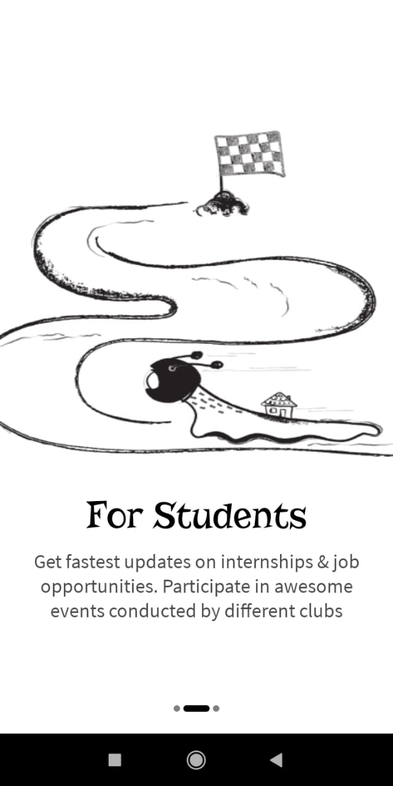

# Android Study Jams
Aris, College News App

## Problem Statement
Often college students miss out on some amazing internships/job opportunities or events, workshops conducted by various clubs just because they didn't get to know about the same. 
And this lack of awareness can significantly impact their connections, network and professional as well as personal growth. There must be an efficient way to track these opportunities
and make the best out of them rather than the traditional social media platforms which are spammed with unwanted messages.

## Proposed Solution with Screenshots
GDSC Mait presents Aris, a one of a kind news application, which specifically targets students of MAIT, to help them get the fastest updates of the events conducted by various clubs,
internships & job opportunities and all kinds of other stuff that the they won't prefer to miss. The app shows daily feed fetched from a Firebase server and acts as the perfect platform 
for clubs to promote their events or for college administration to share important information with the students. The posts can also be saved locally on the device to view them offline or simply
track them better.

|||||
|---|---|---|---|

|||||
|---|---|---|---|

## Functionality and Concepts Used
- The feed is fetched from a `Firestore` database and is updated directly from the console by an administrator or representative whenever required. 
- `Room Database` has been employed to save posts locally on the user's advice and these posts can be viewed in a separate section of the app.

The libraries offered by Jetpack components have been employed extensively in the app ranging from: 
- `Jetpack Viewbinding` to replace the traditional findViewById or Kotlin synthetics. 
- `Preferences Datastore` to store User Name. 
- `Navigation Components` to navigate between different screens.
- `LiveData` and `Viewmodel` coupled with coroutines for an asynchronous behaviour and to preserve fragment's state, data on configuration changes.
-  `Viewpager2` has also been used in the initial intro screens for swipe functionality.

## Future Scope
This is just the tip of the iceberg and there are far too many functionalities that can be implemented in the app in future, like separate email authentication and login for students and clubs,
with clubs being able to post events directly from the app rather than getting them updated manually on the Firebase console, implementing notifications to notify the user on saved events, 
and using cloud messaging for better engagement. A checkout feature can also be added for events so that societies can keep a track of the attendees. These are some of the suggestions and ideas for now, 
which can significantly improve the app's utility.
